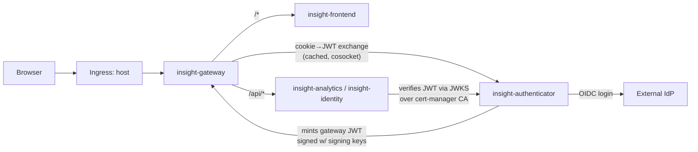

# Deploying Insight with Helm (single umbrella chart)

This runbook shows a platform or DevOps engineer how to install the Insight business app on an existing Kubernetes cluster using only `helm` and `kubectl` — no GitOps controller, no CI pipeline. You edit a small set of values, secret, and connector files, then apply them directly with tools already on your workstation. This is the opposite of GitOps: instead of a reconciler (like Argo CD) continuously syncing this repo's manifests, you run each command once, in order, and re-run `helm upgrade` whenever something changes.

## Contents

<!-- toc -->

- [Contents](#contents)
- [Overview](#overview)
- [Prerequisites](#prerequisites)
  - [Cluster and CLI tools](#cluster-and-cli-tools)
  - [Cluster-level dependencies](#cluster-level-dependencies)
  - [Running external infrastructure](#running-external-infrastructure)
- [Step 1 — Configure values/umbrella.yaml](#step-1--configure-valuesumbrellayaml)
- [Step 2 — Fill the secret files](#step-2--fill-the-secret-files)
  - [secrets/insight-db-creds.yaml](#secretsinsight-db-credsyaml)
  - [secrets/insight-authenticator-signing-keys.yaml](#secretsinsight-authenticator-signing-keysyaml)
- [Step 3 — Create namespace, apply secrets, mirror Airbyte auth](#step-3--create-namespace-apply-secrets-mirror-airbyte-auth)
- [Step 4 — Install with Helm](#step-4--install-with-helm)
- [Step 5 — Verify the install](#step-5--verify-the-install)
- [Step 6 — Configure connectors (optional)](#step-6--configure-connectors-optional)
- [Troubleshooting](#troubleshooting)
- [Appendix — Reference](#appendix--reference)
  - [values/umbrella.yaml placeholders](#valuesumbrellayaml-placeholders)
  - [secrets/insight-db-creds.yaml keys](#secretsinsight-db-credsyaml-keys)
  - [secrets/insight-authenticator-signing-keys.yaml keys](#secretsinsight-authenticator-signing-keysyaml-keys)
  - [values/umbrella.orbstack.yaml (local variant)](#valuesumbrellaorbstackyaml-local-variant)

<!-- /toc -->

## Overview

Insight reads engineering and collaboration data from your tools (Jira, Slack, GitHub, and so on), pipelines it through ClickHouse, and serves metrics to a dashboard behind an OIDC (OpenID Connect, the login protocol) login. It installs as five first-party services in one Helm "umbrella" chart — bundled sub-charts, so a single `helm install` deploys everything — published at `oci://ghcr.io/constructorfabric/charts/insight` (the chart source also lives in-repo at `charts/insight`, which you can install from directly with `helm install insight ./charts/insight` instead of the OCI form). The five are:

- **Gateway** (`insight-gateway`, alias `gateway`) — the OpenResty edge. It owns the public ingress and is the single entrance to the cluster: it routes `/*` to the Frontend and `/api/*` to Analytics/Identity, performing a cached cookie-to-JWT exchange against the Authenticator's `/internal/authz` endpoint (a per-pod Lua cosocket lookup, not nginx's `auth_request`) and injecting the resulting gateway JWT into upstream requests.
- **Authenticator** (`insight-authenticator`, alias `authenticator`) — a separate pod that performs the OIDC login with your IdP, keeps Redis-backed sessions, and mints the ES256 gateway JWT the Gateway injects downstream.
- **Analytics** (`insight-analytics`, alias `analytics`) — serves metrics from the ClickHouse Gold layer.
- **Identity** (`insight-identity`, alias `identity`) — resolves people and org data from MariaDB; optional (`identity.deploy`, default `false`).
- **Frontend** (`insight-frontend`, alias `frontend`) — the web UI (dashboard); optional (`frontend.deploy`, default `true`).

Two more subcharts exist purely for local/dev use and are off by default: `fakeidp` (alias `fakeidp`, condition `fakeidp.deploy`) and `keycloak` (alias `keycloak`, condition `keycloak.deploy`) — both are bundled OIDC providers for a cluster with no real IdP available. `fakeidp` is the one this runbook documents; `keycloak` is a heavier bundled alternative not covered here. Neither is appropriate for a real environment.



This path assumes your data infrastructure (ClickHouse, MariaDB, Redis, Redpanda, Airbyte, Argo Workflows) already runs and is reachable from the cluster, in another namespace or external. The chart doesn't stand it up; it only wires the services to it. You supply one values file, secret files, and optionally one Secret per connector (see [deploy/CONNECTORS.md](./CONNECTORS.md)). No GitOps repo, CI, or auto-reconciliation — you run the commands yourself.

## Prerequisites

### Cluster and CLI tools

- A Kubernetes cluster you can already reach with `kubectl`, with permission to create namespaces, Secrets, workloads, and Roles/RoleBindings — including in the Airbyte namespace when it differs from the app's (the chart installs a Role there that lets its jobs read Airbyte's auth Secret). That namespace must exist before the umbrella install.
- `helm` ≥ 3.8 (OCI registry support is stable from 3.8 onward, since the chart is pulled as an OCI artifact).
- `kubectl`.
- `jq`, used to mirror the Airbyte auth Secret in Step 3.
- `openssl`, used to generate the authenticator's signing key in Step 2.
- `base64`, used when copying existing datastore passwords in Step 2 (most systems ship this by default).

### Cluster-level dependencies

Two things must already be installed in the cluster before you install this chart — neither is bundled by it:

- **An ingress controller.** The Gateway and Frontend ingress blocks are hardcoded to `className: nginx`; install an ingress-nginx controller (or override `gateway.ingress.className` / `frontend.ingress.className` to match whatever you run).
- **cert-manager**, with a working `ClusterIssuer`. The authenticator's TLS-discovery sidecar (`authenticator.tlsDiscovery.enabled: true` by default) creates a `cert-manager.io/v1` `Certificate`, so cert-manager's CRDs must be present. Analytics and Identity trust that cert-manager-issued CA to verify the authenticator's JWKS over HTTPS — this is load-bearing, not optional. The chart's default `issuerRef.name` is `local-ca`; either provision a `ClusterIssuer` with that name, or override `authenticator.tlsDiscovery.issuerRef.name` to point at your own.

### Running external infrastructure

All six systems below must be deployed and reachable from the cluster before you start. The chart never installs any of them — ClickHouse, MariaDB, Redis, and Redpanda are wired in purely by host/credentials (Step 1); Airbyte and Argo Workflows are wired in via `airbyte.apiUrl` and `ingestion.reconcile.argoInstanceId`.

| System | Used for |
|--------|----------|
| ClickHouse | Stores the Bronze (raw ingested data), Silver (cleaned/conformed), and Gold (query-ready) data layers; Analytics reads the Gold layer to serve metrics |
| MariaDB | Owns the `identity` database that Identity uses to resolve people and org data |
| Redis | Caching layer used by Analytics and session storage used by the Authenticator |
| Redpanda | Event-streaming backbone (Kafka-compatible) used by the ingestion pipeline |
| Airbyte | Runs the data connectors (Jira, Slack, GitHub, and so on) that load raw data into ClickHouse Bronze |
| Argo Workflows | Runs the dbt transform workflows that turn Bronze into Silver and Gold, and runs the sync workflows Airbyte connections trigger |

Run all commands here from the directory holding your `values/` and `secrets/` files. This document shows the full `values/umbrella.yaml` skeleton and the secret files, so you can assemble both directories from what follows. Connector configuration (the `connectors/` directory) is a separate, later step — see [deploy/CONNECTORS.md](./CONNECTORS.md).

## Step 1 — Configure values/umbrella.yaml

Create `values/umbrella.yaml` with the skeleton below, then replace every `<...>` placeholder with your infrastructure's real addresses. Passwords never go here — they live in the secret files from Step 2.

```yaml
## values/umbrella.yaml — the only values file you need.
## Fill every <...> placeholder. Passwords are NEVER here — see the secret files.
credentials:
  deploymentMode: helm               # helm | gitops (gitops forbids autoGenerate:true)
  autoGenerate: true                 # BYO compose; won't overwrite a labelless insight-db-creds

global:
  tenantDefaultId: "<TENANT_ID>"     # single-tenant seed UUID; must equal ingestion.reconcile.tenantId
  # storageClass: ""                 # "" = cluster default; e.g. "local-path" locally
  # imagePullSecrets: []             # [{name: my-regcred}] for a private registry

# Datastore wiring — every dep is external; the chart only dials it.
clickhouse:
  host: <CLICKHOUSE_HOST>            # e.g. clickhouse.<infra-ns>.svc.cluster.local
  port: 8123
  database: insight
  username: insight
mariadb:
  host: <MARIADB_HOST>
  port: 3306
  database: insight
  username: insight
redis:
  host: <REDIS_HOST>
  port: 6379
redpanda:
  brokers: "<REDPANDA_BROKERS>"      # e.g. redpanda.<infra-ns>.svc.cluster.local:9093

# Ingestion — point at existing Airbyte + Argo; install the dbt WorkflowTemplates.
ingestion:
  templates:
    enabled: true
  toolboxImage: "<TOOLBOX_IMAGE>"    # e.g. ghcr.io/constructorfabric/insight-toolbox:<tag>
  reconcile:
    tenantId: "<TENANT_ID>"
    destinationName: clickhouse-bronze
    argoInstanceId: "<ARGO_INSTANCE_ID>"     # e.g. argo-workflows-<infra-ns>
airbyte:
  namespace: "<AIRBYTE_NAMESPACE>"   # namespace of the Airbyte release, e.g. <infra-ns>; "" = same as the app
  apiUrl: ""                         # "" = computed from airbyte.releaseName + airbyte.namespace; set only for a non-standard URL

analytics:
  replicaCount: 1                    # chart default 2; bump for HA
  image:
    tag: "<IMAGE_TAG>"               # optional — falls back to the chart's appVersion
  resources:
    requests: { cpu: 100m, memory: 128Mi }
    limits:   { cpu: 500m, memory: 512Mi }

gateway:
  replicaCount: 1
  image:
    tag: "<IMAGE_TAG>"                # optional — falls back to the chart's appVersion
  ingress:
    enabled: true
    className: nginx
    host: <HOST>
    tls:
      enabled: true
      secretName: <TLS_SECRET>
  resources:
    requests: { cpu: 100m, memory: 128Mi }
    limits:   { cpu: 500m, memory: 256Mi }

authenticator:
  replicaCount: 1
  image:
    tag: "<IMAGE_TAG>"
  # ES256 signing keys — see Step 2. MUST already exist as a Secret before install.
  signingKeysSecret: "insight-authenticator-signing-keys"
  # cert-manager Certificate for the JWKS-discovery sidecar. Override
  # issuerRef.name only if your cluster's ClusterIssuer isn't named `local-ca`.
  tlsDiscovery:
    enabled: true
    issuerRef:
      name: local-ca
  oidc:
    issuerUrl: "<OIDC_ISSUER>"        # MUST be set — your IdP's issuer URL
    clientId: "<OIDC_CLIENT_ID>"
    clientSecret: "<OIDC_CLIENT_SECRET>"
    redirectUri: "https://<HOST>/auth/callback"   # MUST be set — browser-facing callback through the gateway
    scopes: ["openid", "profile", "email"]

identity:
  deploy: true                       # MUST be true (chart default false)
  replicaCount: 1
  image:
    tag: "<IMAGE_TAG>"
  databaseName: "identity"
  resources:
    requests: { cpu: 50m,  memory: 96Mi }
    limits:   { cpu: 250m, memory: 384Mi }

frontend:                            # the web UI (dashboard)
  deploy: true
  replicaCount: 1
  image:
    tag: "<IMAGE_TAG>"
  ingress:
    enabled: true                    # WITHOUT this the UI pod runs but is never exposed
    className: nginx
    host: <HOST>                     # same FQDN as gateway.ingress.host; /api/* → Gateway routes, /* → UI
  oidc:                              # public values; the browser starts the login here
    issuer: "<OIDC_ISSUER>"          # same IdP as the authenticator
    clientId: "<OIDC_CLIENT_ID>"
    scopes: "openid profile email"   # IdP-specific

# fakeidp: {deploy: false}           # local/dev-only alternative to a real IdP — see note below
```

If you do not already have this file, you can generate the chart's default values as a starting point instead of typing the skeleton by hand:

```sh
helm show values oci://ghcr.io/constructorfabric/charts/insight > values/umbrella.yaml
```

The placeholder table below explains every `<...>` value in the skeleton:

| Placeholder | What it should be |
|-------------|--------------------|
| `<TENANT_ID>` | Your Insight tenant UUID/slug. Must be the same value in `global.tenantDefaultId` and `ingestion.reconcile.tenantId` |
| `<CLICKHOUSE_HOST>` | ClickHouse HTTP host, in `host:8123` form |
| `<MARIADB_HOST>` | MariaDB host, in `host:3306` form |
| `<REDIS_HOST>` | Redis host, in `host:6379` form |
| `<REDPANDA_BROKERS>` | Redpanda broker(s), in `host:9093` form |
| `<TOOLBOX_IMAGE>` | The ingestion toolbox image reference (drives the WorkflowTemplates and the ClickHouse gold-view migration Job, Step 4/5) |
| `<AIRBYTE_API_URL>` | Airbyte server API URL, for example `http://host:8001` |
| `<ARGO_INSTANCE_ID>` | Your Argo controller's instance ID, for example `argo-workflows-insight-infra` |
| `<IMAGE_TAG>` | The Insight product image tag for each service. All five `image.tag` fields are optional — each falls back to that subchart's `Chart.yaml` appVersion (pinned by the release pipeline). Set them explicitly (recommended) so every service lands on the exact same product build; leaving them blank is safe only when all five subcharts' appVersion are in lockstep in the chart release you install |
| `<HOST>` | Public FQDN for the ingress, shared by the Gateway and Frontend, for example `insight.example.com` |
| `<TLS_SECRET>` | Name of the Kubernetes TLS Secret that covers that domain |
| `<OIDC_ISSUER>` | Your IdP's issuer URL. Its `/.well-known/openid-configuration` document must resolve from inside the cluster |
| `<OIDC_CLIENT_ID>` / `<OIDC_CLIENT_SECRET>` | Your OIDC client / application registration credentials |

For infrastructure running in the same cluster, use the in-cluster DNS form `<service>.<namespace>.svc.cluster.local`. Any resolvable host or IP address also works.

A few settings deserve a closer look before you install:

- **`identity.deploy` must be `true`.** The chart's own default is `false`, so this block requires an explicit override. Without it, the Identity service (and person resolution for the whole app) does not deploy.
- **`authenticator.oidc.issuerUrl` and `authenticator.oidc.redirectUri` are hard requirements.** `charts/insight/templates/secrets.yaml` wraps both in Helm's `required` function — the chart refuses to render without them. There is no auth-off escape hatch: OIDC is mandatory in every environment.
- **No dummy-IdP values file exists for this chart.** If you need a working install without wiring up a real external IdP (local/dev only), enable the bundled fake provider instead: set `fakeidp.deploy: true`, point `authenticator.oidc.issuerUrl` at the in-cluster fakeidp FQDN it exposes, and leave `clientSecret` empty. Never do this in a shared or production cluster. Note: the `fakeidp` (and `keycloak`) images are dev-only and are **not** published to public GHCR — building them locally and loading them into the cluster (or supplying an `imagePullSecret` with access) is required, otherwise the fakeidp pod fails with `ImagePullBackOff` (403). This does not affect a real install, which uses your own IdP and never deploys fakeidp.
- **`authenticator.signingKeysSecret` must already exist.** It is not auto-generated by the chart — create it in Step 2 before installing.

## Step 2 — Fill the secret files

### secrets/insight-db-creds.yaml

This Secret holds the four datastore passwords used by Analytics and Identity. All four keys are required — the chart fails fast if any is missing. Values must match the passwords your datastores were deployed with.

```yaml
apiVersion: v1
kind: Secret
metadata: { name: insight-db-creds, namespace: insight }
type: Opaque
stringData:
  clickhouse-password:   "CHANGE_ME"   # ClickHouse admin password    -> Analytics
  mariadb-password:      "CHANGE_ME"   # MariaDB app-user password    -> Analytics + Identity
  mariadb-root-password: "CHANGE_ME"   # MariaDB root password (identity-DB init hook) -> Identity
  redis-password:        "CHANGE_ME"   # Redis password               -> Analytics + Authenticator
```

If your existing datastores already have these passwords stored in Secrets in your infrastructure namespace, copy them across instead of retyping them:

```sh
NS_INFRA=<your-infra-namespace>                     # where your L2 services run
kubectl -n $NS_INFRA get secret <ch-secret>         -o jsonpath='{.data.<ch-key>}'        | base64 -d; echo   # clickhouse-password
kubectl -n $NS_INFRA get secret <maria-secret>      -o jsonpath='{.data.<app-key>}'       | base64 -d; echo   # mariadb-password (app user)
kubectl -n $NS_INFRA get secret <maria-root-secret> -o jsonpath='{.data.<root-key>}'      | base64 -d; echo   # mariadb-root-password
kubectl -n $NS_INFRA get secret <redis-secret>      -o jsonpath='{.data.<redis-key>}'     | base64 -d; echo   # redis-password
```

Paste the decoded output into the matching `clickhouse-password` / `mariadb-password` / `mariadb-root-password` / `redis-password` field.

> **Do not add an `app.kubernetes.io/managed-by: Helm` label to this Secret.** The chart reads that label's *absence* as "bring your own" credentials. With the label, it assumes ownership and may overwrite your passwords with generated ones. Without it, the chart keeps your values and composes `insight-analytics-config` and `insight-identity-config` from them.

### secrets/insight-authenticator-signing-keys.yaml

The authenticator mints the gateway JWT using an ES256 (EC P-256) key pair. This Secret is **not** auto-generated by the chart — you must create it yourself before `helm install`. Generate a PKCS#8 private key and load it under the required `current.pem` key:

```sh
openssl ecparam -name prime256v1 -genkey -noout | openssl pkcs8 -topk8 -nocrypt -out current.pem
kubectl -n insight create secret generic insight-authenticator-signing-keys --from-file=current.pem
```

During a key rotation, add a `previous.pem` (the outgoing key) alongside the new `current.pem` for at least the JWT TTL plus downstream JWKS-cache age (roughly 65 minutes), then roll the authenticator pods:

```sh
kubectl -n insight create secret generic insight-authenticator-signing-keys \
  --from-file=current.pem --from-file=previous.pem \
  --dry-run=client -o yaml | kubectl apply -f -
```

## Step 3 — Create namespace and apply secrets

Create the `insight` namespace and apply the secret files:

```sh
# create the namespace and apply all secrets
kubectl create namespace insight
kubectl -n insight apply -f secrets/

# verify
kubectl -n insight get secret insight-db-creds insight-authenticator-signing-keys   # expect 4 keys / 1-2 keys (current.pem [+ previous.pem])
```

The Analytics service also needs Airbyte's own auth credentials to talk to the Airbyte API. Mirror that Secret from your infrastructure namespace into `insight`:

```sh
# mirror the Airbyte auth secret from your infra namespace
NS_INFRA=<your-infra-namespace>
kubectl -n $NS_INFRA get secret airbyte-auth-secrets -o json \
  | jq 'del(.metadata.uid,.metadata.resourceVersion,.metadata.creationTimestamp,.metadata.ownerReferences,.metadata.annotations,.metadata.labels) | .metadata.namespace="insight"' \
  | kubectl -n insight apply -f -
```

The `jq` step strips the original Secret's identity fields (UID, resource version, owner references) and retargets it to the `insight` namespace, so Kubernetes accepts it as a new object.

## Step 4 — Install with Helm

Run the umbrella chart install, pointing it at your filled-in values file:

```sh
helm upgrade --install insight oci://ghcr.io/constructorfabric/charts/insight \
  -n insight -f values/umbrella.yaml --wait --timeout 15m
```

Omit `--version` to install the latest published chart, or add `--version <x.y.z>` to pin a specific release. `--wait --timeout 15m` blocks the command until all resources report ready, or until 15 minutes pass, whichever comes first — this gives you a clear pass/fail signal instead of a detached background rollout.

This command also runs a post-install/post-upgrade Helm hook Job, `insight-clickhouse-migrate`, which applies the ClickHouse gold-view migrations (`src/ingestion/scripts/migrations/*.sql`) against your external ClickHouse using `ingestion.toolboxImage`. It runs on **every** `helm upgrade`, not just the first install — this is gated by `clickhouse.runMigrations` (default `true`). `helm upgrade` blocks on this Job the same way it blocks on any other resource; a failing migration fails the whole upgrade. The migration script drops-and-recreates every gold object on each run, so a genuine migrate-Job failure usually points to a schema/data problem in the referenced Bronze/Silver tables, not a stale-object conflict.

## Step 5 — Verify the install

Confirm all pods are running (Identity only appears when `identity.deploy: true`; fakeidp/keycloak only when their `deploy` flag is set):

```sh
kubectl -n insight get pods
  # expect: insight-gateway, insight-authenticator, insight-analytics, insight-identity, insight-frontend  (all Running)
```

Confirm the chart composed the per-service config Secrets from `insight-db-creds`:

```sh
kubectl -n insight get secret insight-analytics-config insight-authenticator-config insight-identity-config
  # chart composed these from insight-db-creds (insight-identity-config only exists when identity.deploy=true)
```

Inspect the ClickHouse gold-view migration hook Job and confirm it completed:

```sh
kubectl -n insight get jobs -l app.kubernetes.io/component=clickhouse-migrate
kubectl -n insight logs job/insight-clickhouse-migrate
```

Confirm the reconcile loop's scheduled workflow exists — this is the job that discovers connector Secrets and provisions Airbyte sources and connections automatically:

```sh
kubectl -n insight get cronworkflow
  # expect: insight-reconcile-loop (provisions Airbyte sources/connections)
```

Finally, open `https://<HOST>` in a browser (the host you set in Step 1) and confirm the login redirect to your OIDC provider works.

## Step 6 — Configure connectors (optional)

Configuring connectors is a separate operation from installing the app, done once the app is up and running. There are 25 available connectors, each a single Kubernetes Secret that the `insight-reconcile-loop` CronWorkflow discovers and auto-provisions as an Airbyte source — no further steps once it's applied and filled in correctly.

See [deploy/CONNECTORS.md](./CONNECTORS.md) for the full list of connectors and a copy-paste-ready example Secret for each.

## Troubleshooting

| Problem | What to check |
|---------|-----------------|
| `insight-analytics` / `insight-identity` stuck in `CreateContainerConfigError` | The chart could not compose the `*-config` Secrets. Confirm `insight-db-creds` has all four keys and carries **no** `app.kubernetes.io/managed-by: Helm` label: `kubectl -n insight get secret insight-db-creds -o yaml \| grep managed-by` should return nothing |
| `helm install`/`upgrade` fails with `signingKeysSecret is required` or the authenticator pod won't mount its keys | The Secret named in `authenticator.signingKeysSecret` (default `insight-authenticator-signing-keys`) doesn't exist or is missing `current.pem`. Create it as shown in Step 2 before installing |
| `helm install`/`upgrade` fails with `tlsDiscovery.issuerRef.name is required` or the `insight-authenticator-authn-tls` Certificate never turns `Ready` | cert-manager isn't installed, or the `ClusterIssuer` named in `authenticator.tlsDiscovery.issuerRef.name` (default `local-ca`) doesn't exist. Confirm with `kubectl get clusterissuer local-ca` and `kubectl -n insight describe certificate insight-authenticator-authn-tls` |
| `helm install`/`upgrade` fails with `authenticator.oidc.issuerUrl is required` / `redirectUri is required` | Both fields are mandatory (`charts/insight/templates/secrets.yaml` wraps them in `required`). Set real values, or for local/dev only, set `fakeidp.deploy: true` and point `issuerUrl` at the in-cluster fakeidp — never disable auth |
| Dashboards show "no peer data" (the benchmark/comparison panel is empty) | After Gold-layer data has loaded, restart Analytics: `kubectl -n insight rollout restart deploy/insight-analytics` |
| Login breaks after changing the host | Update `authenticator.oidc.redirectUri` (and `frontend.oidc.issuer`/`clientId` if the IdP changed) in values, `helm upgrade`, then restart the gateway: `kubectl -n insight rollout restart deploy/insight-gateway` |

For connector-syncing problems, see the Troubleshooting section of [deploy/CONNECTORS.md](./CONNECTORS.md).

## Appendix — Reference

### values/umbrella.yaml placeholders

| Placeholder | Field(s) | Notes |
|-------------|----------|-------|
| `<TENANT_ID>` | `global.tenantDefaultId`, `ingestion.reconcile.tenantId` | Must be identical across both |
| `<CLICKHOUSE_HOST>` | `clickhouse.host` | Always external; port fixed at `8123` in the file |
| `<MARIADB_HOST>` | `mariadb.host` | Always external; port fixed at `3306` |
| `<REDIS_HOST>` | `redis.host` | Always external; port fixed at `6379` |
| `<REDPANDA_BROKERS>` | `redpanda.brokers` | Always external; include port, e.g. `:9093` |
| `<TOOLBOX_IMAGE>` | `ingestion.toolboxImage` | Drives the ingestion WorkflowTemplates and the ClickHouse gold-view migrate Job |
| `<AIRBYTE_API_URL>` | `airbyte.apiUrl` | e.g. `http://host:8001` |
| `<ARGO_INSTANCE_ID>` | `ingestion.reconcile.argoInstanceId` | Your Argo controller's instance ID |
| `<IMAGE_TAG>` | `gateway.image.tag`, `authenticator.image.tag`, `analytics.image.tag`, `identity.image.tag`, `frontend.image.tag` | All five are optional — each falls back to that subchart's `Chart.yaml` appVersion (pinned by the release pipeline). Set them explicitly (recommended) so every service lands on the exact same product build; leaving them blank is safe only when all five subcharts' appVersion are in lockstep in the chart release you install |
| `<HOST>` | `gateway.ingress.host`, `frontend.ingress.host` | Public FQDN, shared by the Gateway and Frontend (`/*` → UI, `/api/*` → Gateway routes to Analytics/Identity) |
| `<TLS_SECRET>` | `gateway.ingress.tls.secretName` | Kubernetes TLS Secret name |
| `<OIDC_ISSUER>` | `authenticator.oidc.issuerUrl`, `frontend.oidc.issuer` | Your IdP's issuer URL |
| `<OIDC_CLIENT_ID>` / `<OIDC_CLIENT_SECRET>` | `authenticator.oidc.clientId`/`clientSecret`, `frontend.oidc.clientId` | Your OIDC client / application registration credentials |

Other notable (non-placeholder) settings in this file:

- `credentials.deploymentMode: helm` and `credentials.autoGenerate: true` — this enables the "bring your own" credentials path, where the chart keeps a labelless `insight-db-creds` Secret instead of generating random passwords.
- `identity.deploy: true` — required override; the chart's own default is `false`.
- `authenticator.tlsDiscovery.issuerRef.name: local-ca` — the cert-manager `ClusterIssuer` name the JWKS-discovery Certificate is issued from; override to match your cluster's issuer.
- There is no auth-off toggle anywhere in this chart. `authenticator.oidc.issuerUrl` and `authenticator.oidc.redirectUri` are hard `required` fields — the simplest no-real-IdP path is `fakeidp.deploy: true`, local/dev only; `keycloak.deploy: true` is a heavier bundled alternative (not documented here).

### secrets/insight-db-creds.yaml keys

| Key | Meaning | Consumed by |
|-----|---------|--------------|
| `clickhouse-password` | ClickHouse admin password | Analytics |
| `mariadb-password` | MariaDB app-user password | Analytics + Identity |
| `mariadb-root-password` | MariaDB root password, used by the identity-DB init hook | Identity |
| `redis-password` | Redis password | Analytics + Authenticator |

Recall: this Secret must never carry an `app.kubernetes.io/managed-by: Helm` label.

### secrets/insight-authenticator-signing-keys.yaml keys

| Key | Meaning |
|-----|---------|
| `current.pem` | The active ES256 (EC P-256) signing key, PKCS#8 PEM, unencrypted. Required. |
| `previous.pem` | The outgoing key during a rotation window. Optional; keep it alongside `current.pem` until the JWT TTL plus downstream JWKS-cache age has elapsed |

### values/umbrella.orbstack.yaml (local variant)

This file is a pre-filled variant of the values file for local development on OrbStack's bundled k3s cluster, with all infrastructure running in an `insight-infra` namespace. It sets a fixed tenant UUID, in-cluster DNS hosts, an empty (host-less) ingress that matches any `Host` header, disabled TLS, and points the authenticator at the in-cluster `fakeidp`/`keycloak` provider rather than a real IdP. Use it only as a reference for local testing — do not reuse its host-less ingress, disabled TLS, or fake-IdP settings on a shared or production cluster.
