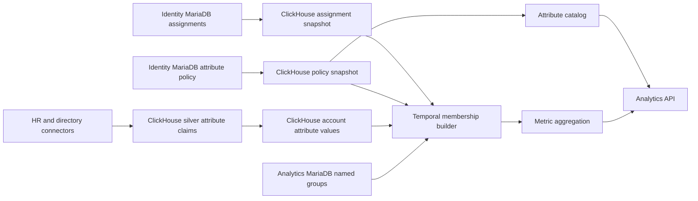
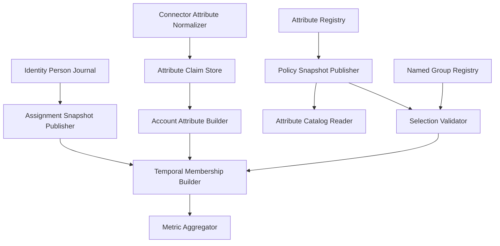
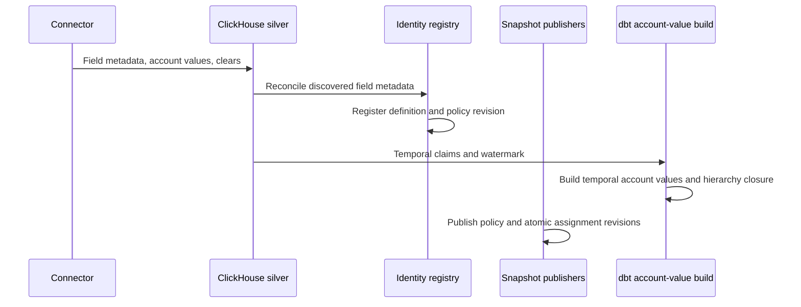
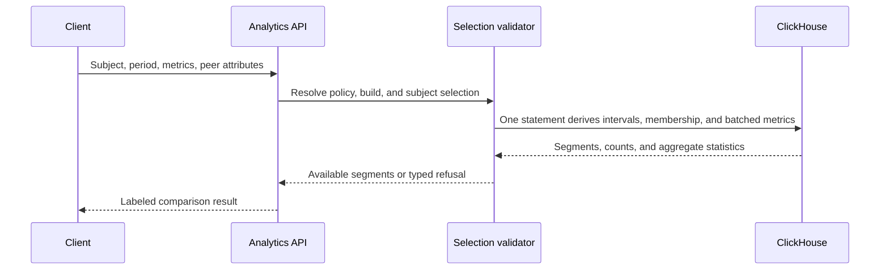
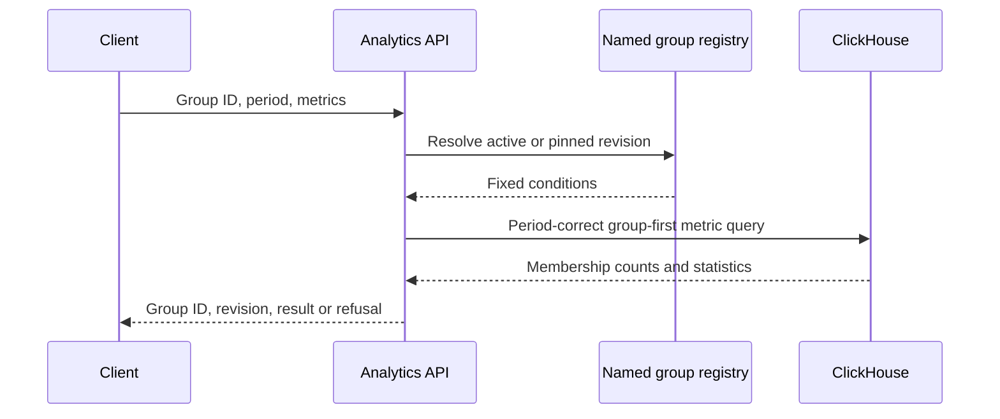

# Technical Design — Person Attributes and Cohorting

<!-- toc -->

- [Changelog](#changelog)
- [1. Architecture Overview](#1-architecture-overview)
  - [1.1 Architectural Vision](#11-architectural-vision)
  - [1.2 Architecture Drivers](#12-architecture-drivers)
  - [1.3 Architecture Layers](#13-architecture-layers)
- [2. Principles & Constraints](#2-principles--constraints)
  - [2.1 Design Principles](#21-design-principles)
  - [2.2 Constraints](#22-constraints)
- [3. Technical Architecture](#3-technical-architecture)
  - [3.1 Domain Model](#31-domain-model)
  - [3.2 Component Model](#32-component-model)
  - [3.3 API Contracts](#33-api-contracts)
  - [3.4 Internal Dependencies](#34-internal-dependencies)
  - [3.5 External Dependencies](#35-external-dependencies)
  - [3.6 Interactions & Sequences](#36-interactions--sequences)
  - [3.7 Database Schemas & Tables](#37-database-schemas--tables)
  - [3.8 Deployment Topology](#38-deployment-topology)
- [4. Additional Context](#4-additional-context)
  - [4.1 Identity Integration and Transition](#41-identity-integration-and-transition)
  - [4.2 Temporal Semantics](#42-temporal-semantics)
  - [4.3 Group Condition Semantics](#43-group-condition-semantics)
  - [4.4 Availability and Refusal Model](#44-availability-and-refusal-model)
  - [4.5 Security and Privacy](#45-security-and-privacy)
  - [4.6 Performance, Capacity, and Cost](#46-performance-capacity-and-cost)
  - [4.7 Reliability and Operations](#47-reliability-and-operations)
  - [4.8 Maintainability and Verification Strategy](#48-maintainability-and-verification-strategy)
  - [4.9 Scope Boundaries and Known Limitations](#49-scope-boundaries-and-known-limitations)
  - [4.10 Applicability Notes](#410-applicability-notes)
  - [4.11 Traceability](#411-traceability)

<!-- /toc -->

- [ ] `p1` - **ID**: `cpt-person-attributes-design-cohorting`
## Changelog

- **v1.0**: Initial design for connector-discovered person attributes, temporal history, grouping, people-like comparison, and fixed named groups.

## 1. Architecture Overview

### 1.1 Architectural Vision

The subsystem makes identity attributes usable by analytics without turning Identity into an analytical datastore. Connector-provided attribute claims and their history remain source-account-scoped in ClickHouse, where ingestion already lands source data. Identity MariaDB owns the tenant-curated attribute definition and comparison policy. A versioned policy snapshot and the current source-account-to-person assignment snapshot are published into ClickHouse. Cohort queries join temporal account attributes to the current assignment projection and deduplicate canonical people before aggregating metrics.

A cohort is evaluated at query time as `GROUP BY` over one or more governed attributes. The runtime first finds matching canonical people for the requested period, then aggregates their metrics. It does not materialize every possible attribute combination. A people-like comparison derives conditions from the selected person's values. A named group stores fixed, immutable condition revisions so thresholds and other consumers can refer to a stable definition.

The initial release preserves source meaning. It does not create manual attributes, manual person values, canonical job families, or value aliases. `Python Developer` and `Backend Developer` remain distinct values. A named group can intentionally include both exact values without claiming they are globally equivalent.

The requirements source is [GitHub issue #2028](https://github.com/constructorfabric/insight/issues/2028). No repository PRD exists for this epic.

### 1.2 Architecture Drivers

**ADRs**:

- `cpt-person-attributes-adr-attribute-data-ownership`
- `cpt-person-attributes-adr-identity-and-time-semantics`

#### Functional Drivers

| Requirement | Design Response |
|-------------|-----------------|
| Discover attributes from supported connectors | Connector models emit field metadata and temporal source-account claims into a common silver contract. |
| Present usable names rather than source keys | Server labels resolve from tenant override, connector field label, known product label, then deterministic humanization. |
| Group by one or several attributes | One temporal membership builder applies AND between conditions and OR between selected exact values within a condition. |
| Compare people with peers | The subject's values become period-correct group conditions; server-side aggregation returns statistics only when policy and minimum population allow it. |
| Support fixed named groups | Tenant-owned groups have stable IDs and immutable condition revisions. |
| Preserve history | Attribute claims and values use half-open validity intervals and declare the earliest reliable history boundary. |
| Support single- and multi-valued attributes | Connector metadata declares value mode and the query detects violations defensively; multi-valued attributes can group but comparison is refused until a weighting rule exists. |
| Govern discovered attributes | Admins can change labels, optional sensitivity classification, grouping/comparison eligibility, lifecycle, and source presentation without editing source facts. |
| Distinguish manager semantics | `manager` and `manager_subtree` are separate keys based on canonical person IDs, never display names. |
| Explain unavailable results | Responses carry counts and typed refusals such as small group, disallowed comparison, unsupported multi-value comparison, incomplete history, or no data. |

#### NFR Allocation

| NFR ID | NFR Summary | Allocated To | Design Response | Verification Approach |
|--------|-------------|--------------|-----------------|----------------------|
| Correctness | Temporal and identity correctness | Assignment projection, account values, membership builder | Account assignment is corrective and joined at query time; attribute facts remain effective-dated and account-scoped. | Boundary, reassignment, clear, and query-time resolution scenarios. |
| Isolation | Tenant isolation | All storage and query contracts | Every record carries `insight_tenant_id`; predicate enforcement follows the existing analytics flag until tenant alignment is enabled. | Disabled-mode compatibility and enabled-mode cross-tenant checks. |
| Privacy | Prevent unsafe peer disclosure | Policy snapshot, validator, metric aggregator | Comparison eligibility and `min_peer_n` are server-enforced; member identities are never returned. | Policy-bypass and intersected-small-group scenarios. |
| Performance | Bound analytical cost | ClickHouse projections, request limits, group-first query | Values are ordered for subject and value lookup; membership is built once per request and reused by batched metrics. | Representative warehouse benchmarks and query-plan review. |
| Reliability | Stable request semantics | Revisioned policy and atomic assignment snapshots | Each request pins policy and assignment revisions while account facts retain their own ingestion watermark. | Concurrent-publication and stale-input scenarios. |
| Observability | Explain freshness and coverage | Assignment publisher and result diagnostics | Policy revision, assignment revision, attribute watermark, unresolved accounts, and refusal reason are exposed or logged. | Operational dashboard and structured-log review. |

### 1.3 Architecture Layers

- [ ] `p1` - **ID**: `cpt-person-attributes-tech-layered-cohorting`

| Layer | Responsibility | Technology |
|-------|----------------|------------|
| Source ingestion | Extract field metadata, values, stable source-account identity, and changes | Airbyte, connector normalization, dbt staging/silver |
| Identity governance | Own curated definitions, policy versions, audit, and current person assignment | Identity service, MariaDB |
| Analytical transformation | Publish assignments and policy; build temporal account values and account-level hierarchy closure | dbt, ClickHouse |
| Analytics application | Expose catalog, validate selections, resolve named groups, compile membership, aggregate metrics | Analytics service, Rust |
| Configuration | Store stable named groups and immutable revisions | Analytics service, MariaDB |

## 2. Principles & Constraints

### 2.1 Design Principles

#### Keep analytical facts near analytical queries

- [ ] `p1` - **ID**: `cpt-person-attributes-principle-analytical-facts-in-clickhouse`

Connector claims, temporal account values, assignment projections, and policy projections used by cohort queries live in ClickHouse. Identity MariaDB remains authoritative for editable policy and person assignment; it is not duplicated as the source of analytical history.

**ADRs**: `cpt-person-attributes-adr-attribute-data-ownership`

#### Preserve source truth

- [ ] `p1` - **ID**: `cpt-person-attributes-principle-source-truth`

Source field identity, source instance, raw value, optional immutable value ID, display value, observation time, and clear/delete state remain recoverable. Labels may improve presentation but never replace identifiers.

#### Measure the actual request population

- [ ] `p1` - **ID**: `cpt-person-attributes-principle-request-scoped-measurement`

Curated policy answers whether and how an attribute may be used. Value discovery and metric requests calculate their own disclosure-safe counts, observed cardinality, `group_n`, and `measured_n` over the selected period and current assignment. Persisted catalog-wide population statistics cannot authorize or refuse a request.

**ADRs**: `cpt-person-attributes-adr-attribute-data-ownership`

#### Resolve accounts before grouping

- [ ] `p1` - **ID**: `cpt-person-attributes-principle-source-account-resolution`

Attribute claims use the stable source-account key `(tenant, source type, source instance, source account ID)`. The current canonical assignment for that key determines the person. Email is not used to resolve an attribute-producing account when the stable key exists.

**ADRs**: `cpt-person-attributes-adr-identity-and-time-semantics`

#### Group first, aggregate second

- [ ] `p1` - **ID**: `cpt-person-attributes-principle-group-first`

One ClickHouse query derives a person-grain membership relation from conditions before joining metric observations. It never aggregates per source claim or precomputes rows for attribute combinations.

#### Make temporal ambiguity visible

- [ ] `p1` - **ID**: `cpt-person-attributes-principle-temporal-segmentation`

When a people-like subject changes selected values during a requested period, the result is split into maximal stable segments. A changing subject is not assigned one blended peer definition.

**ADRs**: `cpt-person-attributes-adr-identity-and-time-semantics`

#### Absence is not zero

- [ ] `p1` - **ID**: `cpt-person-attributes-principle-typed-absence`

Unavailable comparisons return a typed refusal. Counts distinguish matching linked people, metric contributors, unresolved source accounts, and unavailable denominator information.

### 2.2 Constraints

#### Connector-discovered attributes only

- [ ] `p1` - **ID**: `cpt-person-attributes-constraint-discovered-only`

The initial release has no tenant-created attribute definitions, manual per-person values, bulk custom imports, value aliasing, or canonical taxonomy. Admin writes govern discovered attributes and named groups only.

#### Exact source values

- [ ] `p1` - **ID**: `cpt-person-attributes-constraint-exact-values`

Grouping compares stable source value IDs when available, otherwise exact source values. A fixed condition may contain several values to form a broader group. The system does not infer semantic equivalence.

#### Source fields remain separate

- [ ] `p1` - **ID**: `cpt-person-attributes-constraint-source-scoped-definitions`

One definition represents one stable field identity from one source instance. The initial release does not merge similarly named fields across connectors or apply source priority. If two sources expose `Job title`, the catalog returns two source-qualified attributes and the UI renders the source when needed, for example `Job title — BambooHR`.

#### Connector scope is the ingestion boundary

- [ ] `p1` - **ID**: `cpt-person-attributes-constraint-connector-scope`

The supported connector descriptor determines which source fields are collected. Discovered values are published to analytics; there is no pending-classification state that withholds values. Comparison remains controlled independently by the curated `comparison_allowed` flag.

#### History starts at retained evidence

- [ ] `p1` - **ID**: `cpt-person-attributes-constraint-history-horizon`

The system cannot reconstruct changes before the first retained snapshot or changes a source never exposed. Every attribute publishes its earliest reliable time and history precision. A request requiring earlier data is refused as `history_incomplete`.

#### Rename safety requires immutable source IDs

- [ ] `p1` - **ID**: `cpt-person-attributes-constraint-stable-value-identity`

Stored conditions survive display-value renames only when the source provides an immutable value ID. Label-only data, including the current Bamboo department projection, cannot promise rename-safe references.

#### Account assignment is currently corrective

- [ ] `p1` - **ID**: `cpt-person-attributes-constraint-corrective-assignment`

The current identity journal represents the latest account-to-person decision and applies it retroactively to all retained claims for that account. This is valid only while native account IDs are not reused between humans and shared or service accounts are excluded. Effective-dated assignment is a future contract extension if that invariant does not hold.

**ADRs**: `cpt-person-attributes-adr-identity-and-time-semantics`

#### Tenant enforcement follows platform readiness

- [ ] `p1` - **ID**: `cpt-person-attributes-constraint-tenant-enforcement-flag`

All new contracts carry `insight_tenant_id`. While `metric_catalog.enforce_tenant_scope` is false, ingestion and analytics use the configured/default tenant exactly as current metric queries do. When the flag is enabled, source, assignment, policy, values, named groups, and metrics must share real tenant IDs and every query must enforce the tenant predicate. #2028 does not claim multi-tenant isolation while the flag is disabled.

#### Manager hierarchy has one authority

- [ ] `p1` - **ID**: `cpt-person-attributes-constraint-manager-authority`

`manager` and `manager_subtree` are different keys based on canonical manager person IDs. A tenant designates one authoritative source instance for manager edges. Subtree use additionally requires temporal closure without cycles or ambiguous active parents.

## 3. Technical Architecture

### 3.1 Domain Model

**Technology**: Rust domain types, MariaDB entities, ClickHouse relations, OpenAPI-generated client types.

**Location**: New types will be placed in the owning Identity, analytics, and dbt modules; this design defines their shared semantics.

**Core Entities**:

| Entity | Description |
|--------|-------------|
| Attribute Definition | Stable tenant and source-scoped identity for a discovered field, with declared value mode, current label, and lifecycle. |
| Attribute Policy Revision | Immutable curated state for presentation, optional sensitivity class, grouping/comparison eligibility, source authority, and retirement. |
| Attribute Claim | Effective-dated source assertion for one source account, field, and value. |
| Person Assignment | Current resolution of one stable source account to a canonical person, or an unresolved/excluded state. |
| Account Attribute Value | Effective-dated, query-oriented source-account fact that remains independent of canonical person assignment. |
| Group Condition | Attribute plus operator and one or more exact value identities. |
| Named Group Revision | Immutable, tenant-owned condition set behind a stable group ID. |
| Comparison Selection | Tagged request variant: people-like or named group. |
| Comparison Result | Tagged available result or typed refusal with safe diagnostics. |

Attribute labels resolve in this order:

1. Tenant label override.
2. Source-provided field label.
3. Product label for a known connector field.
4. Deterministic humanization of the source key.

For example, `customFunctionalTeam` becomes `Custom Functional Team` only when no better label exists. The catalog also returns the source display name so identical fallback labels remain distinguishable.

Relationships:

- One attribute definition has many immutable policy revisions and source claims.
- One source-account assignment can resolve many historical account attribute values at query time.
- One claim produces zero or one account-scoped analytical value without copying `person_id`.
- One named group has many immutable revisions; each revision has one condition set.
- A people-like selection creates transient conditions and is never stored as a named group.

Principal invariants:

- All identifiers and relationships carry a tenant.
- Attribute intervals for the same claim identity do not overlap.
- Assignment state is typed; reason strings do not drive behavior.
- A source clear closes the active interval and is not treated as a missing ingestion row.
- A declared single-valued attribute has at most one effective value per source account and definition at an instant; the runtime detects conflicting values after several accounts resolve to one person.
- Named-group revisions are immutable after creation.
- Metric aggregation consumes one row per canonical person in membership.

### 3.2 Component Model

#### Connector Attribute Normalizer

- [ ] `p1` - **ID**: `cpt-person-attributes-component-normalizer`

##### Why this component exists

Supported connectors expose different field names, value shapes, snapshot behavior, and source identifiers.

##### Responsibility scope

Projects connector field metadata and value observations into a common ClickHouse contract with tenant, source type, source instance, source account ID, field identity, optional immutable value ID, display value, effective time, and clear/delete semantics. Snapshot-only sources use the existing dbt snapshot pattern to derive changes.

##### Responsibility boundaries

It does not assign canonical people, normalize business meaning, create manual values, or decide comparison eligibility.

##### Related components (by ID)

- `cpt-person-attributes-component-claim-store` — receives normalized claims.
- `cpt-person-attributes-component-registry` — reconciles the resulting discovered-field metadata.

#### Attribute Claim Store

- [ ] `p1` - **ID**: `cpt-person-attributes-component-claim-store`

##### Why this component exists

Historical grouping requires source facts before person resolution and must preserve later identity corrections.

##### Responsibility scope

Maintains the ClickHouse silver history of field discovery, value assertions, and clears keyed by stable source account and source field. It exposes claim and source watermarks to the account attribute projection and request diagnostics.

##### Responsibility boundaries

It is not editable by admins, does not contain curated policy, and is not directly queried by public APIs.

##### Related components (by ID)

- `cpt-person-attributes-component-account-value-builder` — consumes temporal claims.
- `cpt-person-attributes-component-normalizer` — supplies claims.

#### Attribute Registry

- [ ] `p1` - **ID**: `cpt-person-attributes-component-registry`

##### Why this component exists

Discovered source keys need stable IDs, readable labels, lifecycle, comparison policy, audit, and transactional admin writes.

##### Responsibility scope

Owns Identity MariaDB definitions and immutable policy revisions. A scheduled, idempotent reconciliation reads the ClickHouse discovered-field relation and registers new definitions; connectors do not dual-write Identity. The registry applies the deterministic label chain and lets authorized admins override labels, record optional sensitivity classification, enable or disable grouping, enable or disable peer comparison, choose the authoritative manager source, and retire an attribute. Known connector mappings may seed initial policy. Unknown discovered fields are publishable for grouping and default to comparison denied until explicitly allowed.

##### Responsibility boundaries

It does not store person values, normalize values, merge unrelated source fields, calculate coverage, or answer metric requests.

##### Related components (by ID)

- `cpt-person-attributes-component-policy-publisher` — publishes immutable policy revisions.
- `cpt-person-attributes-component-catalog-reader` — presents curated attribute metadata.

#### Policy Snapshot Publisher

- [ ] `p1` - **ID**: `cpt-person-attributes-component-policy-publisher`

##### Why this component exists

Analytics must enforce policy without a request-time Identity call or a second editable copy.

##### Responsibility scope

Publishes a complete immutable policy revision from Identity MariaDB into ClickHouse. A revision contains definitions, declared value mode, labels, source presentation, optional sensitivity class, lifecycle, grouping policy, comparison policy, and manager-source authority. Publication records row count, checksum, and source revision.

##### Responsibility boundaries

It cannot activate a partial revision or mutate source policy. It publishes no person values.

##### Related components (by ID)

- `cpt-person-attributes-component-registry` — authoritative producer.
- `cpt-person-attributes-component-catalog-reader` — current catalog consumer.
- `cpt-person-attributes-component-selection-validator` — query-policy consumer.

#### Assignment Snapshot Publisher

- [ ] `p1` - **ID**: `cpt-person-attributes-component-assignment-publisher`

##### Why this component exists

Claims identify source accounts while analytics groups canonical people.

##### Responsibility scope

Builds a ClickHouse projection of the current assignment for each stable source-account key from the latest `value_type = 'id'` record in `identity.identity_persons`. It publishes an atomic current snapshot with a monotonically identifiable assignment revision. Identity corrections trigger this small projection refresh independently of the dbt attribute pipeline. The initial states are linked and unresolved; future identity workflows may additionally publish quarantined and excluded without changing query consumers.

##### Responsibility boundaries

It does not resolve attribute claims by email, reinterpret assignment history as effective-dated, or own human correction workflows.

##### Related components (by ID)

- `cpt-person-attributes-component-membership-builder` — resolves account facts through the current assignment.

#### Account Attribute Builder

- [ ] `p1` - **ID**: `cpt-person-attributes-component-account-value-builder`

##### Why this component exists

Peer queries need one long-form temporal relation across connector-specific claim models without binding source facts to mutable person assignment.

##### Responsibility scope

Builds effective-dated `account_attribute_values`, direct source-account manager edges, and account-level temporal ancestor closure from connector claims. It retains optional immutable value IDs, exact labels, source provenance, history horizon, and ingestion watermark. It does not copy canonical `person_id`; identity corrections therefore require no attribute rebuild.

##### Responsibility boundaries

It does not edit assignments or policy, resolve people, infer value equivalence, or calculate catalog or metric statistics.

##### Related components (by ID)

- `cpt-person-attributes-component-claim-store` — claim input.
- `cpt-person-attributes-component-membership-builder` — resolves account facts during queries.

#### Attribute Catalog Reader

- [ ] `p1` - **ID**: `cpt-person-attributes-component-catalog-reader`

##### Why this component exists

Clients need a minimal list of governed discovered attributes for request construction and presentation.

##### Responsibility scope

Reads the current policy revision from ClickHouse and returns stable ID, key, resolved label, source, declared value mode, sensitivity class when set, grouping/comparison eligibility, and lifecycle. A separate bounded value-search operation calculates exact IDs/labels and safe counts on demand for group authoring without inflating metric definitions.

##### Responsibility boundaries

It does not calculate or expose catalog-level fill rate, distinct-value count, largest-group size, raw value lists, or unlinked identities.

##### Related components (by ID)

- `cpt-person-attributes-component-policy-publisher` — current revision source.
- `cpt-person-attributes-component-selection-validator` — shared catalog semantics.

#### Named Group Registry

- [ ] `p1` - **ID**: `cpt-person-attributes-component-named-group-registry`

##### Why this component exists

Thresholds and rules need a stable population definition independent of the person currently viewed.

##### Responsibility scope

Stores tenant-owned named-group IDs and immutable revisions in Analytics MariaDB. Each revision contains a label, normalized condition set, and the policy revision under which its attribute/value references were accepted. Live use resolves the active group revision; stored consumers pin a group revision. Retiring an attribute blocks new ad hoc selection and new group revisions but does not invalidate an existing pinned revision while its source history remains available.

##### Responsibility boundaries

It does not store member lists or metric results. Editing creates a new revision rather than changing historical meaning.

##### Related components (by ID)

- `cpt-person-attributes-component-selection-validator` — validates and resolves revisions.
- `cpt-person-attributes-component-membership-builder` — evaluates fixed conditions.

#### Selection Validator

- [ ] `p1` - **ID**: `cpt-person-attributes-component-selection-validator`

##### Why this component exists

Expected unavailable states must be rejected consistently before SQL compilation.

##### Responsibility scope

Pins the current policy revision, assignment revision, and attribute watermark, then validates tenant ownership, lifecycle, grouping/comparison policy, sensitivity classification, declared value mode, condition limits, named-group revision, history horizon, hierarchy health, and request variant. New selections use current policy. Pinned named-group revisions use their retained policy revision and stored exact value references. The compiled query detects multi-value violations defensively and produces typed refusal reasons.

##### Responsibility boundaries

It does not trust client-supplied labels, sensitivity flags, counts, member lists, or SQL fragments.

##### Related components (by ID)

- `cpt-person-attributes-component-catalog-reader` — current attribute policy.
- `cpt-person-attributes-component-membership-builder` — receives validated selections.

#### Temporal Membership Builder

- [ ] `p1` - **ID**: `cpt-person-attributes-component-membership-builder`

##### Why this component exists

Every grouping and comparison path needs identical person-grain, period-correct membership semantics.

##### Responsibility scope

Joins temporal account attribute values to the current source-account assignment projection, applies AND between conditions and OR within multi-value conditions, intersects authorized population, and deduplicates canonical people. People-like requests derive conditions for each stable subject interval. Named groups use fixed conditions while membership may vary over time. Unresolved accounts remain available for request diagnostics but never become members.

##### Responsibility boundaries

It does not aggregate metrics, reveal members, normalize values, or substitute current membership for historical membership.

##### Related components (by ID)

- `cpt-person-attributes-component-selection-validator` — validated input.
- `cpt-person-attributes-component-metric-aggregator` — person-grain membership output.

#### Metric Aggregator

- [ ] `p1` - **ID**: `cpt-person-attributes-component-metric-aggregator`

##### Why this component exists

Peer statistics must be computed once, consistently, and with the same minimum-population rule.

##### Responsibility scope

Extends the existing analytics query compiler to join membership to canonical metric observations and compute count, median, quartiles, minimum, and maximum server-side. It returns `group_n` for matching linked people and `measured_n` for contributors; `min_peer_n` applies to `measured_n`.

##### Responsibility boundaries

It does not return member identities or let the browser recompute peer statistics.

##### Related components (by ID)

- `cpt-person-attributes-component-membership-builder` — membership input.
- `cpt-person-attributes-component-catalog-reader` — response labels and diagnostics.

### 3.3 API Contracts

- [ ] `p1` - **ID**: `cpt-person-attributes-interface-analytics-api`

- **Contracts**: Attribute catalog, metric comparison, admin attribute policy, and named groups.
- **Technology**: REST/OpenAPI with generated TypeScript clients.
- **Location**: Existing Identity and analytics OpenAPI modules.

**Endpoints Overview**:

| Method | Path | Description | Stability |
|--------|------|-------------|-----------|
| `GET` | `/v1/metric-definitions` | Add the active allowed-attribute catalog to the response already read by clients. | Additive |
| `POST` | `/v1/metric-results` | Add tagged grouping/comparison selections and typed comparison results. | Additive |
| `GET/PUT` | Existing Identity admin configuration surface | Read and revise discovered attribute policy. Exact route follows the #1682 admin console contract. | New operation |
| `GET` | `/v1/person-attributes/{attribute_id}/values` | Search and page exact value IDs/labels for authorized grouping and named-group authoring, optionally bounded by period. | New |
| `GET/POST/PUT` | Analytics named-group configuration surface | Manage stable named groups and immutable revisions. | New operation |

`POST /v1/metric-results` adds two independent concepts:

- `group_by`: zero or more person-attribute IDs controlling result partitioning. Multi-valued attributes may emit the same person into several value groups; each group deduplicates that person, and overlapping group counts are explicitly non-additive.
- `comparison`: either `people_like` with subject person ID and one or more attribute IDs, or `named_group` with stable group ID and optional pinned revision.

Grouping is distinct from existing metric-dimension `filters`. Grouped responses include stable attribute/value identity and labels, the covered period, and person count. The existing single `cohort_key` request remains supported through an adapter during migration. New comparison responses return an available comparison or a stable refusal code. Refusal codes include `group_below_minimum`, `sensitive_attribute`, `comparison_not_allowed`, `multi_value_comparison_unsupported`, `history_incomplete`, `no_subject_value`, `no_data`, `hierarchy_unavailable`, `policy_unavailable`, and `identity_resolution_unavailable`.

Every available result includes `group_n`, `measured_n`, unresolved source-account count when measurable, policy revision, assignment revision, attribute watermark, and period/segment.

The value-discovery operation is required because metric definitions intentionally do not embed unbounded value lists. It is available only for attributes whose grouping policy permits discovery, applies tenant and caller visibility, returns counts only above the disclosure minimum, and never changes the exact value identity selected by the caller.

The API never reports unresolved source accounts as exact unlinked people.

### 3.4 Internal Dependencies

| Dependency Module | Interface Used | Purpose |
|-------------------|----------------|---------|
| Connector ingestion | Normalized attribute claim contract | Discover source fields and temporal values. |
| Identity service | Definitions, policy revisions, audit, current person journal | Govern use and resolve source accounts. |
| persons-sync | `identity.identity_persons` atomic snapshot | Publish the current account assignment journal to ClickHouse. |
| dbt ingestion | Silver/gold models | Build temporal account values and account-level hierarchy closure from connector claims. |
| Analytics metric catalog | Existing metric-definition response | Publish the client-readable attribute list. |
| Analytics metric results | Existing request validator and query compiler | Build groups and calculate statistics. |
| API gateway | Existing security context | Authenticate, authorize, and provide tenant context. |

Dependency rules:

- MariaDB owners publish immutable snapshots; analytics does not query Identity MariaDB on the read path.
- ClickHouse claims are never written back into Identity as a second fact history.
- Both attribute and metric identity resolution produce the same canonical person ID.
- Security context and the tenant-enforcement mode propagate through validation and compilation.
- Cross-domain communication uses explicit persisted or API contracts, not internal Rust types.

### 3.5 External Dependencies

#### HR and directory systems

Supported systems must provide a stable source-account identifier and field metadata. Immutable field and value identifiers are used when present. Snapshot-only sources are supported with bounded history precision. A source that cannot represent a clear or delete cannot provide reliable end dates.

#### MariaDB and ClickHouse

Identity MariaDB provides transactional definitions, policy versions, and audit. Analytics MariaDB provides named-group identity and immutable revisions. ClickHouse stores source claims, published assignments and policy, temporal account values, account-level manager closure, and metric observations.

#### Non-applicable dependencies

No new vendor service, message broker, CDN, or deployable database is introduced. Optional caches are revision-keyed and non-authoritative.

### 3.6 Interactions & Sequences

#### Discover and publish attributes

**ID**: `cpt-person-attributes-seq-discover-publish`

Policy, assignment, and attribute facts have independent revisions. A request pins their current identifiers before compiling one ClickHouse statement. A newly discovered definition without values returns `no_data`; values without an enabled definition are not selectable. Neither state can produce an unauthorized comparison.

#### Compare a person with people like them

**ID**: `cpt-person-attributes-seq-people-like`

If selected subject values change, the validator returns separate stable segments. Each segment can have a different peer population, but subject history, segment derivation, membership, and aggregation are compiled into one parameterized ClickHouse statement.

#### Evaluate a named group

**ID**: `cpt-person-attributes-seq-named-group`

Two clients using the same named-group revision, period, policy revision, assignment revision, and attribute watermark receive the same definition and data snapshot. Membership may still change within the period because the conditions are fixed but people's attributes are temporal.

### 3.7 Database Schemas & Tables

- [ ] `p1` - **ID**: `cpt-person-attributes-db-storage`

| Store | Relation | Grain | Purpose |
|-------|----------|-------|---------|
| Identity MariaDB | `person_attribute_definitions` | Tenant and stable attribute ID | Source identity, current presentation, lifecycle. |
| Identity MariaDB | `person_attribute_policy_revisions` | Attribute and immutable revision | Presentation, sensitivity, source authority, grouping/comparison policy, and retirement history. |
| Identity MariaDB | `person_attribute_policy_audit` | Policy mutation | Actor-attributed governance history. |
| Analytics MariaDB | `named_groups` | Tenant and group ID | Stable named-group identity. |
| Analytics MariaDB | `named_group_revisions` | Group and immutable revision | Fixed normalized condition set. |
| ClickHouse silver | `person_attribute_claims` | Source account, field, value, interval | Source fact history including clears and provenance. |
| ClickHouse identity | `person_account_assignments_current` | Stable source-account key | Current canonical person assignment and resolution state. |
| ClickHouse policy | `person_attribute_policy_snapshot` | Attribute and policy revision | Immutable analytical policy projection. |
| ClickHouse gold | `account_attribute_values` | Source account, attribute, value, interval | Query-oriented temporal values without canonical person ownership. |
| ClickHouse gold | `account_manager_ancestors` | Manager account, descendant account, interval | Temporal source-account subtree membership. |

The logical claim and account-value key contains tenant, source type, source instance, source account, source field identity, value identity, and validity interval. Values retain both optional immutable `value_id` and `value_label`; conditions prefer the ID. Neither relation stores canonical `person_id`.

`account_attribute_values` supports two read patterns:

- Account history ordered by tenant, source, source account, attribute, and validity.
- Group candidates ordered or projected by tenant, attribute, value, validity, and source account.

There is no persisted `person_attribute_stats` relation in V1. Catalog-level fill rate, distinct-value count, and largest-group size are not required for grouping or comparison correctness. Value discovery calculates exact values and disclosure-safe counts for the requested attribute and period. Metric requests calculate `group_n`, `measured_n`, unresolved-account count, and observed multi-value conflicts from the actual query population.

Policy and assignment snapshots publish complete revisions independently of account-value ingestion. A request pins the current policy revision, atomic assignment revision, and attribute watermark before compilation. Because canonical ownership is joined in the request, reassignment becomes visible after the assignment snapshot refresh and does not wait for dbt.

### 3.8 Deployment Topology

- [ ] `p1` - **ID**: `cpt-person-attributes-topology-existing-services`

No new deployable service is required. Connector workers and dbt jobs extend existing ingestion. Identity extends its existing admin and snapshot responsibilities. Analytics extends its metric-definition and metric-results handlers. MariaDB and ClickHouse remain inside their current replication, backup, encryption, and secret-management boundaries.

The read path is Analytics API to Analytics MariaDB for a named-group revision when needed, then one ClickHouse query for membership and metrics. It has no request-time connector or Identity service call. Stateless analytics replicas may cache catalogs and named-group revisions by tenant and immutable revision.

## 4. Additional Context

### 4.1 Identity Integration and Transition

The existing `identity.identity_persons` ClickHouse snapshot contains the full person journal copied from Identity MariaDB. The current identity-resolution code already derives known account bindings from the latest `value_type = 'id'` observation per tenant, source type, source instance, and source account ID. #2028 formalizes that shape as the `PersonAssignment` projection.

The separate WIP identity redesign can later become the assignment producer without changing claims, account values, or analytics requests. Its human decisions remain corrective: rebinding an account changes the current assignment projection, and every subsequent query resolves all retained account history to the corrected person. The projection contract, not the current resolver implementation, is the dependency boundary.

Email resolution remains valid for metric observations that contain only email, such as current Git commit models. Those observations and stable source-account claims resolve independently to the same canonical person ID. Email-resolved metric facts retain their own identity watermark, while account attributes use the current assignment revision. Unresolved or not-yet-refreshed metric aliases reduce `measured_n`; they do not reduce the attribute-derived `group_n`.

### 4.2 Temporal Semantics

Attribute intervals are half-open: `[valid_from, valid_to)`. A clear or replacement closes the old interval. Missing data in one incomplete sync does not imply a clear.

People-like comparison intersects the requested period with the subject's selected attribute histories. It returns maximal intervals in which all selected values are stable. For example, a person who changes from Frontend to Backend midway through 2025 receives a Frontend peer result for the first interval and a Backend result for the second.

A named-group revision is fixed, but membership is temporal. Metric observations contribute only while the person satisfies the fixed conditions. The result reports unique matching linked people and metric contributors for the requested period; it does not substitute current headcount.

### 4.3 Group Condition Semantics

Conditions are combined with AND. Several values inside one condition are combined with OR.

Example:

- `office IN (Singapore)`
- AND `job_title IN (Backend Developer, Python Developer)`

This deliberately forms one fixed group without creating value aliases. A people-like request does not broaden values this way; it uses the subject's exact selected value or value ID.

Multi-valued attributes may participate in grouping with set-membership semantics and person-grain deduplication. They cannot drive peer comparison until a weighting/counting rule is approved because one person could otherwise contribute to several peer populations.

### 4.4 Availability and Refusal Model

Selection availability is the intersection of:

- Active curated policy.
- Declared value mode and runtime-observed cardinality for the requested operation.
- History coverage for the requested period.
- Healthy hierarchy when a manager-subtree attribute is selected.

The runtime distinguishes:

- `group_n`: canonical linked people satisfying the conditions.
- `measured_n`: those people contributing data to the requested metric.
- `unresolved_source_accounts`: source accounts with claims but no usable assignment, when measurable.
- `unlinked_people`: deliberately not reported as exact because unresolved accounts are not known distinct humans.

`min_peer_n` applies to `measured_n`, because statistics over fewer contributing observations remain unsafe even when the attribute group itself is large.

### 4.5 Security and Privacy

The existing gateway, tenant context, subject visibility, and metric authorization remain authoritative. Cohort membership is not an authorization mechanism. The query builder enforces comparison policy and minimum contributor count; hiding an option in the UI is insufficient.

Responses never contain peer member identities. Attribute IDs, value IDs, group IDs, and revisions are resolved server-side within tenant scope. Source values are bound query parameters, not SQL identifiers. Logs exclude raw attribute values and record policy denials, cross-tenant identifier attempts, repeated small-group probes, projection unavailability, and hierarchy failures.

The initial connector scope is the data-minimization boundary. #2028 does not add a pending-classification workflow that withholds discovered values. Policy may record an audited sensitivity class independently of grouping/comparison flags so a denied comparison can return `sensitive_attribute` rather than a generic policy denial. Unclassified discovery does not block publication.

### 4.6 Performance, Capacity, and Cost

Storage grows with source claims and effective account-value intervals, not with combinations of attributes. The value-oriented ClickHouse ordering/projection adds storage but avoids scanning unrelated attributes and values during membership lookup.

Membership is built once and reused for batched metrics. The existing request limits remain authoritative. Cohorting adds bounded condition and selected-value counts configured with the query compiler. Exact launch limits and latency targets require representative warehouse benchmarks; the design does not claim the epic's sub-second target without evidence.

No new paid service or infrastructure tier is required. Material costs are ClickHouse storage for claims and projections and CPU for temporal interval joins.

### 4.7 Reliability and Operations

The consistency model is transactional within each MariaDB owner and eventual across policy, assignment, and account-value publication. Requests pin the current policy revision, atomic assignment revision, and attribute watermark. Assignment corrections do not mutate or rebuild attribute facts.

Operational signals include:

- Current policy revision, assignment revision, and attribute watermark by tenant.
- Claim, identity, and policy publication lag.
- Unresolved-account changes in actual requests.
- Failed policy, assignment, or account-value publication.
- Typed refusal rates, scanned rows, execution time, segment count, and response size.
- Hierarchy cycles, ambiguity, and stale closure.

Rollback restores the previous complete policy or assignment snapshot and previous named-group revision where applicable. Account values rebuild deterministically from retained claims, but assignment correction never requires that rebuild. Existing database recovery and service rollout controls apply.

### 4.8 Maintainability and Verification Strategy

The architecture has one normalized connector claim contract, one current assignment projection, one account-value model, one minimal policy catalog, one membership builder, and one server-side metric-statistics implementation. Derived producers can later emit the same claim/value contract without special query paths.

Verification must cover source clears, duplicate snapshots, account reassignment without attribute rebuild, unresolved accounts, non-overlapping value intervals, label fallback, exact-value grouping, several conditions, declared and observed multi-value refusal for comparison, named-group revision pinning, subject segmentation, minimum population, metric coverage, manager hierarchy, independent publication revisions, and both tenant-enforcement modes.

### 4.9 Scope Boundaries and Known Limitations

The initial release excludes:

- Manual/custom attribute definitions and person values.
- Value aliases, canonical job families, fuzzy matching, and automated clustering.
- Peer comparison for multi-valued attributes.
- Implementation of future derived producers such as expected function, behavioral role, or metric-derived levels.
- A separate public attribute-catalog endpoint.
- Persisted catalog-level fill rate, distinct-value count, and largest-group statistics; V1 computes only values and counts needed by value discovery or the actual metric request.
- Materialized attribute-combination cohorts.
- A new authorization model or portal implementation.

Known data limitations:

- Historical accuracy begins at retained source evidence.
- Exact unlinked-person counts are impossible from unresolved accounts.
- Rename-safe conditions require immutable source value IDs.
- Corrective account assignment assumes native IDs are not reused across people.
- `manager_subtree` requires authoritative temporal hierarchy closure.
- Multi-tenant enforcement is not delivered while `metric_catalog.enforce_tenant_scope` remains false; tenant plumbing is present so the existing flag can govern the transition.

Unavailable capabilities return typed states. They are not replaced by current values, label hashes, guessed people, zeros, or silent best effort.

### 4.10 Applicability Notes

Infrastructure as code is not applicable because the design adds no deployable unit or infrastructure resource. Frontend layout, offline behavior, and progressive enhancement are not applicable because #2028 is a DB/API epic. A new authentication or consent system is not applicable because existing platform controls and tenant governance remain authoritative.

### 4.11 Traceability

| Design Element | Issue #2028 scope |
|----------------|-------------------|
| Connector normalizer and claim store | Attributes from supported sources, provenance, clears, and history. |
| Registry and policy publisher | Label, source, grouping/comparison policy, retirement, versioning, and audit. |
| Assignment publisher and account-value builder | Current canonical person linkage and query-oriented temporal account values. |
| Catalog reader | Minimal allowed-attribute metadata without persisted population statistics. |
| Selection validator and membership builder | One or several conditions, people-like selection, named groups, and period correctness. |
| Metric aggregator | Server-side statistics, population minimum, counts, and typed refusals. |
| Named-group registry | Stable references for thresholds, rules, recommendations, and recorded outcomes. |
| Manager hierarchy contract | Separate direct-manager and subtree semantics. |

Related decisions and designs:

- [ADR-0001: Keep account attribute facts in ClickHouse](./ADR/0001-attribute-data-ownership-v1.md)
- [ADR-0002: Separate corrective identity from temporal attributes](./ADR/0002-identity-and-time-semantics-v1.md)
- [Metrics design](../../metrics/specs/DESIGN.md)
- [Identity resolution design](../../identity-resolution/specs/DESIGN.md)
- [Org-chart design](../../org-chart/specs/DESIGN.md)
- [Ingestion data-flow design](../../ingestion-data-flow/specs/DESIGN.md)
- [Analytics API design](../../../components/backend/analytics/DESIGN.md)
